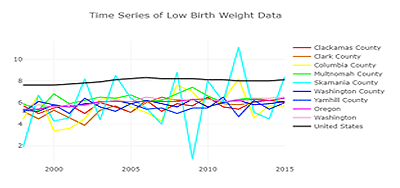
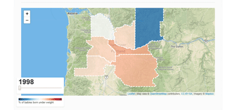

<nav class="navbar navbar-expand-lg navbar-light bg-light">

</nav>

## Getting Started

1.  Load requirements.txt
1.  In Postgres create a new database: low_birth_weight
1.  Open jupyter notebook and run low_birth_weight.ipynb (change line: In [7] with your postgres user/password/port)
1.  Create a config.py in js folder with your mapbox API: var API_KEY = "API_KEY_HERE"
1.  Run $ python app.py (change lines 16-18 with your postgres user/password/port)
1.  Open browser to http://localhost:5000/  
Enjoy!

## Percentage of Low Birth Weight Babies in the Portland Metropolitan Area, 1998-2015

Using three visualizations: a line chart, a choropleth with draggable timeline, and an error bar bar chart, we explore the percentages of babies born with low birth weights in the Portland Metropolitan Area. We begin with a line chart for an overall view of US, state and county data, then we move onto a choropleth for a closer look at county changes over time, and we end with an error bar bar chart for a deeper view of each county.

### The Importance of the Data

For this study, low birth weights were defined as any weight less than 2,500 grams (about 5.51 pounds). According to our source data: _"Babies with low birth weights face increased risks of infection, impaired development, developmental delays, and higher rates of infant death."_ With multiple factors that can influence the occurrence of babies born with low birth weights, exploring this data set hopefully helps to narrow the scope of specific counties with higher than average, low birth weight percentages.

#### Purpose

The purpose of this presentation is to explore the aggregated low birth weight data by county, state, and country to answer one main question: In what way is this data useful? We embark on an exploration to both observe trends and ask questions of those observations to determine if some of the observations can be explained by simple or obvious reasons, or if the observations are telling us something new and insightful. Another reason for exploration of the data is also to see if the data shows where knowledge is lacking and can launch new inqueries into other datasets that may help suss out a more nuanced understanding of the specific causes of low birth weight surrounding the Portland Metropolitan area.

##### Observations and Questions

As you progress through the website using the links at the top or the pictures of the graphs on the side, we will state some observations based on the charts and graphs and pose some questions. If you have questions or observations of your own, please feel free to explore on you own.

<section id="visualizations">

## Visualizations

  
Line: Counties, State and US

  
Choropleth: Counties Over Time  

  
Bar: Averages with Min & Max

</section>

